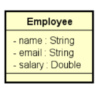

# Exercício de fixação

## Descrição do Exercício
Este programa tem como objetivo ler os dados de funcionários (nome, email e salário) a partir de um arquivo no formato .csv.
Após a leitura, o programa realiza duas operações:

1. Exibe, em ordem alfabética, os emails dos funcionários cujo salário é superior a um valor fornecido pelo usuário.
2. Calcula e exibe a soma dos salários dos funcionários cujo nome começa com a letra 'M'.

## Formato do Arquivo
O arquivo de entrada deve ter o seguinte formato:
`Nome,Email,Salário`
Cada linha representa um funcionário, onde o nome, email e salário estão separados por vírgulas.

**Exemplo de Arquivo de Entrada (`in.txt`):**

```
Maria,maria@gmail.com,3200.00
Alex,alex@gmail.com,1900.00
Marco,marco@gmail.com,1700.00
Bob,bob@gmail.com,3500.00
Anna,anna@gmail.com,2800.00
```

## Execução do Programa
Ao executar o programa, ele solicitará que o usuário insira o caminho completo para o arquivo de entrada e um valor de salário.
O programa processará os dados e exibirá os emails dos funcionários que ganham mais que o valor fornecido, além da soma 
dos salários dos funcionários cujo nome começa com 'M'.

**Exemplo de Saída:**

```
Enter full file path: in.txt
Enter salary: 2000.00
Email of people whose salary is more than 2000.00:
anna@gmail.com
bob@gmail.com
maria@gmail.com
Sum of salary of people whose name starts with 'M': 4900.00
```

## Estrutura do Código
O código é dividido em duas classes principais: `Employee` e `Program`.

1. Classe `Employee`
    - Esta classe representa um funcionário, contendo informações sobre o nome, email e salário.

### Estrutura da Classe Employee
A classe Employee é responsável por armazenar os dados dos funcionários. Abaixo está a representação da classe:



**Atributos da Classe Employee**
- **name**: String - O nome do funcionário
- **email**: String - O email do funcionário
- **salary**: Double - O salário do funcionário

2. Classe `Program`
    - Esta classe contém o método `main`, que é o ponto de entrada do programa.

## Como Executar o Programa
1. Certifique-se de que o arquivo `.csv` está no formato correto.
2. Compile o programa.
3. Execute o programa e forneça o caminho completo para o arquivo `.csv` quando solicitado.
4. Informe um valor de salário quando solicitado.
5. O programa exibirá os emails dos funcionários que ganham mais que o valor fornecido e a soma dos salários dos funcionários cujo nome começa com 'M'.

## Observações
- O programa assume que o arquivo existe e que está no formato correto.
- O salário é tratado como um número decimal e está formatado para exibição com duas casas decimais.
- Os emails dos funcionários são exibidos em ordem alfabética.

## Melhorias Propostas
**Substituição por Referência de Método**
- Os comentários agora mencionam claramente que as expressões lambda, que obtêm os emails e salários, podem ser substituídas
por referências de método. Essa prática é comum em Java 8 e versões posteriores, onde métodos existentes são referenciados diretamente,
tornando o código mais conciso e legível.

**Exemplo de Substituição**
- Para o método `map`, a expressão `x -> x.getEmail()` poderia ser substituída por `Employee::getEmail`.
- Para o método `map(x -> x.getSalary())`, poderia ser `Employee::getSalary`.
- Para o método `filter`, a expressão x -> `x.getName().charAt(0) == 'M'` poderia ser substituída por `x -> x.getName().startsWith("M")`,
que é mais legível e expressa melhor a intenção de filtrar os nomes que começam com a letra 'M'.

**Otimização da Coleta de Resultados**
- O uso do `collect(Collectors.toList())` pode ser substituído pelo método `toList()` em versões mais recentes do Java,
que é mais direto e resulta em um código mais limpo.

**Sugestão de Tratamento de Exceções**
- Para melhorar a robustez do programa, pode ser interessante adicionar validações para verificar se o arquivo existe e 
se o formato está correto antes de tentar lê-lo. Isso pode incluir verificar se os campos estão completos e se os valores
numéricos são válidos, evitando assim exceções indesejadas.

**Melhoria na Apresentação da Saída**
- A formatação da saída pode ser melhorada para incluir mensagens mais informativas, como a contagem total de funcionários
que atendem aos critérios, além dos emails e da soma dos salários. Isso tornaria a interação com o usuário mais rica e informativa.